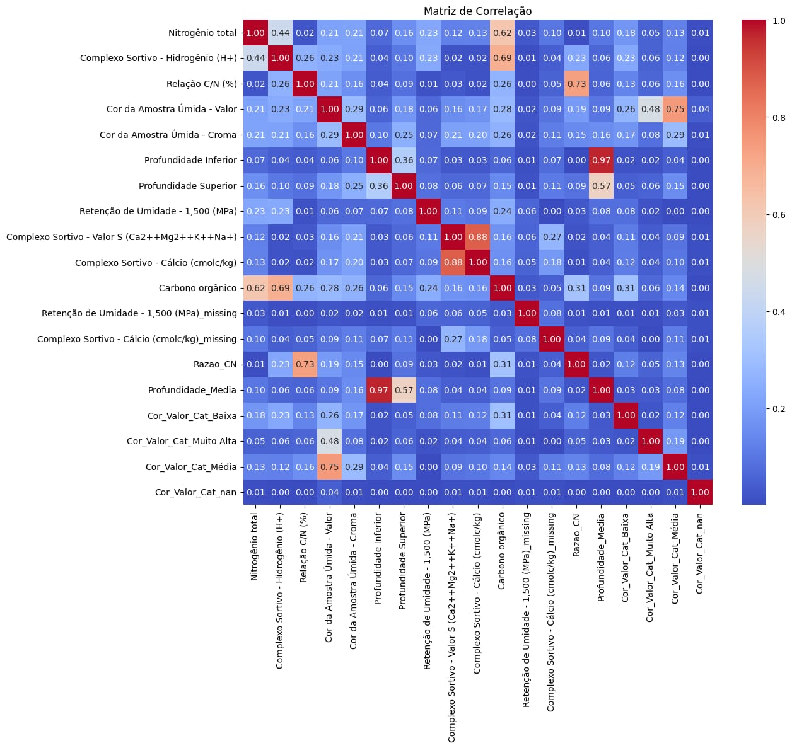
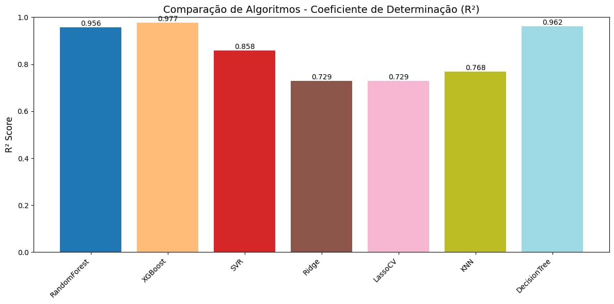
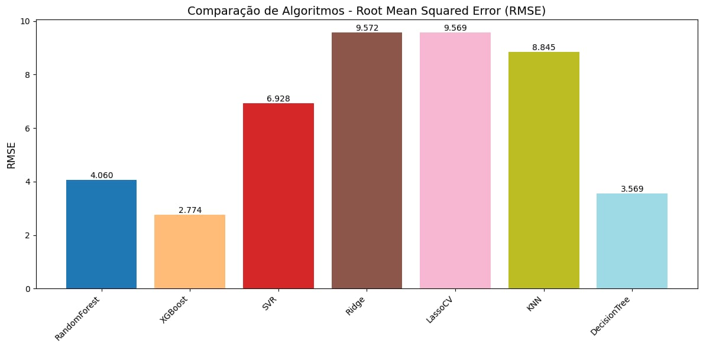

# Predição de Carbono Orgânico em Solos Brasileiros Usando Técnicas de Aprendizado de Máquina

Este repositório contém o código e a documentação para a predição de níveis de carbono orgânico em solos brasileiros utilizando técnicas de aprendizado de máquina. O projeto aplica algoritmos de regressão a uma base de dados pública do Redape (Embrapa) para prever o carbono orgânico do solo (SOC), essencial para a fertilidade, sequestro de carbono, mitigação das mudanças climáticas e segurança alimentar.

O trabalho, desenvolvido por Hugo Nogueira, Klissia de Paula da Costa e Gustavo Enrick Oliveira, foi baseado em uma análise de variáveis físico-químicas como nitrogênio total, profundidade e complexo sortivo. A metodologia inclui pré-processamento, imputação com KNNImputer, padronização, engenharia de features, seleção de variáveis e avaliação com métricas como R² e RMSE. O modelo XGBoost destacou-se como o de melhor desempenho.

## Introdução
O carbono orgânico no solo refere-se primariamente ao material vegetal que se decompôs parcialmente e se acumulou ao longo de milhares de anos. Este acúmulo ocorre sob condições de saturação hídrica, o que é crucial para a formação de solos orgânicos. Esses solos são compostos por material vegetal parcialmente decomposto. Esse acúmulo acontece em ambientes saturados de água por milênios [Bourdon et al. 2023].
[...]

Há uma demanda crescente por informações que auxiliem a agricultura sustentável e melhorem a qualidade da terra. A compreensão do ciclo do carbono no solo é vital para atender a essa demanda. Solos com bons estoques de carbono orgânico geralmente apresentam melhor estrutura, maior capacidade de retenção de água e nutrientes, e são mais férteis [Haddad et al, 2018]. 
[...]

Dessa forma a aplicação de técnicas de aprendizado de máquina para a previsão dos níveis de carbono orgânico no solo é de extrema importância para a agricultura sustentável tendo em vista o conhecimento da distribuição espacial das propriedades físicas e químicas do solo, como o carbono orgânico, é muito importante para a modelagem ambiental e o manejo adequado dos solos [Bhering et al, 2016].

Neste contexto, este trabalho propõe uma análise de dados de solos brasileiros pública, onde será posta em comparação vários modelos de aprendizado de máquina para fazer uma previsão dos níveis de carbono orgânico do solo do território brasileiro. Os modelos desenvolvidos neste trabalho são avaliados pelas métricas de coeficiente de determinação (R²) e de Raiz do Erro Quadrático Médio (RMSE).

## Metodologia
1. **Carregamento e Seleção de Dados**: Carrega o CSV, limpa nomes de colunas, seleciona features-chave.
2. **Imputação**: Usa KNNImputer para valores numéricos ausentes.
3. **Engenharia de Features**:
   - Calcula razão C/N.
   - Determina profundidade média.
   - Categoriza e codifica o valor de cor da amostra úmida.
4. **Análise Exploratória**: Matriz de correlação para detectar multicolinearidade.

   

6. **Treinamento de Modelos**: Divisão treino-teste, escalonamento e otimização de hiperparâmetros (ex.: GridSearchCV para KNN e DecisionTree).
7. **Avaliação**: Validação cruzada (quando aplicável), R² e RMSE.
8. **Visualizações**: Heatmap de correlação, gráficos de barras para R² e RMSE.

O código é implementado em Python com bibliotecas como Pandas, Scikit-learn, XGBoost e Matplotlib/Seaborn.

## Modelos e Avaliação
Sete modelos de regressão foram implementados e comparados:
- **Random Forest**: Ensemble de árvores; validado com 5 folds.
- **XGBoost**: Gradient boosting; treinado com 100 estimadores.
- **SVR (Support Vector Regression)**: Otimizado com RandomizedSearchCV (C, epsilon, kernel).
- **Ridge**: Regressão linear com regularização L2 (alpha=1.0).
- **LassoCV**: Regressão linear com regularização L1; seleção de alpha via validação cruzada.
- **KNN (K-Nearest Neighbors)**: GridSearchCV para k ótimo (1-30, valores ímpares); curva de validação plotada.
- **Decision Tree**: GridSearchCV para max_depth, min_samples_split/leaf, max_features.

Métricas:
- **R² (Coeficiente de Determinação)**: Mede a variância explicada (maior é melhor).
- **RMSE (Root Mean Squared Error)**: Mede o erro de predição (quanto mais próximo de 10, pior, e quanto mais próximo de 1, melhor) .

## Resultados
- **Melhor Modelo**: XGBoost com R² = 0,9774 e baixo RMSE = 2,765
- **Visualizações**:
  - Gráfico de Barras R²:
 
    
    
  - Gráfico de Barras RMSE: XGBoost com menor erro.

	

# Referências

MENDONÇA, Bruno AF DE et al. Soils, Geoenvironments and Ecosystem Services of a Protected Area in Western Brazilian Amazonia. Anais da Academia Brasileira de Ciências, v. 95, n. suppl 1, p. e20221071, 2023.

BOURDON, Karolane et al. Mitigating CO2 emissions from cultivated peatlands: Efficiency of straws and wood chips applications in maintaining carbon stock in two contrasting soils. Frontiers in Soil Science, v. 3, p. 1285964, 2023.

Haddad, D. B. et al. (2018). Brazilian soil bulk density prediction based on a committee
	of neural regressors. IEEE - Institute of Electrical and Electronic Engineers.

BHERING, Silvio Barge et al. Mapeamento digital de areia, argila e carbono orgânico por modelos Random Forest sob diferentes resoluções espaciais. Pesquisa Agropecuária Brasileira, v. 51, n. 9, p. 1359-1370, 2016.

GOMES, Lucas Carvalho et al. Modelling and mapping soil organic carbon stocks in Brazil. Geoderma, v. 340, p. 337-350, 2019.

PARDELINHA, Alexandre et al. Aplicaçao de Técnicas de Aprendizado de Máquina na Determinaçao de Estoque de Carbono no Solo. In: Simpósio Brasileiro de Banco de Dados (SBBD). SBC, 2024. p. 673-679.

FERREIRA, Ana Carolina S. et al. Predicting soil carbon stock in remote areas of the Central Amazon region using machine learning techniques. Geoderma Regional, v. 32, p. e00614, 2023.

SEU, Kimseth; KANG, Mi-Sun; LEE, HwaMin. An intelligent missing data imputation techniques: A review. JOIV: International Journal on Informatics Visualization, v. 6, n. 1-2, p. 278-283, 2022.

LOURENÇO, Valéria Ramos. Predição digital do carbono orgânico do solo no bioma Caatinga auxiliado por sensoriamento remoto. 2017.

KULKARNI, Vrushali Y.; SINHA, Pradeep K. Random forest classifiers: a survey and future research directions. Int. J. Adv. Comput, v. 36, n. 1, p. 1144-1153, 2013.

GOHIYA, H.; LOHIYA, H.; PATIDAR, K. A Survey of Xgboost system. Int. J. Adv. Technol. Eng. Res, v. 8, p. 25-30, 2018.

SINGLA, Manisha; GHOSH, Debdas; SHUKLA, K. K. A survey of robust optimization based machine learning with special reference to support vector machines. International Journal of Machine Learning and Cybernetics, v. 11, n. 7, p. 1359-1385, 2020.

SHAO, Donghang et al. Reconstruction of daily gridded snow water equivalent product for the Pan-Arctic region based on a ridge regression machine learning approach. Earth System Science Data Discussions, v. 2021, p. 1-33, 2021.

DIEBOLD, Francis X.; SHIN, Minchul. Machine learning for regularized survey forecast combination: Partially-egalitarian lasso and its derivatives. International Journal of Forecasting, v. 35, n. 4, p. 1679-1691, 2019.

PENG, Heping et al. Survey on kNN. In: CAIBDA 2022; 2nd International Conference on Artificial Intelligence, Big Data and Algorithms. VDE, 2022. p. 1-7.

RANA, Kaushik K. et al. A survey on decision tree algorithm for classification. International journal of Engineering development and research, v. 2, n. 1, p. 1-5-1-5, 2014.

